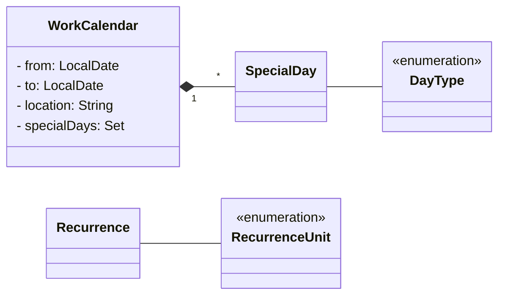

```mermaid
classDiagram
    direction LR
    class WorkCalendar {
        - from: LocalDate
        - to: LocalDate
        - location: String
        - specialDays: Set<SpecialDay>
    }
    class SpecialDay
    class DayType
    <<enumeration>> DayType

    WorkCalendar "1" *-- "*" SpecialDay
    SpecialDay -- DayType

    class Recurrence
    class RecurrenceUnit
    <<enumeration>> RecurrenceUnit

    Recurrence -- RecurrenceUnit
```
